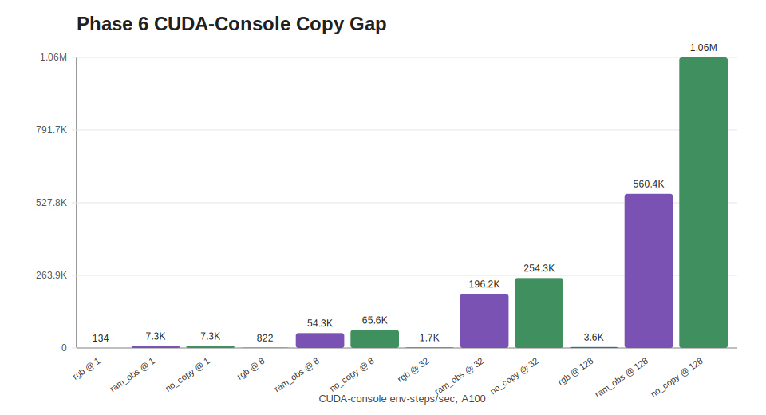
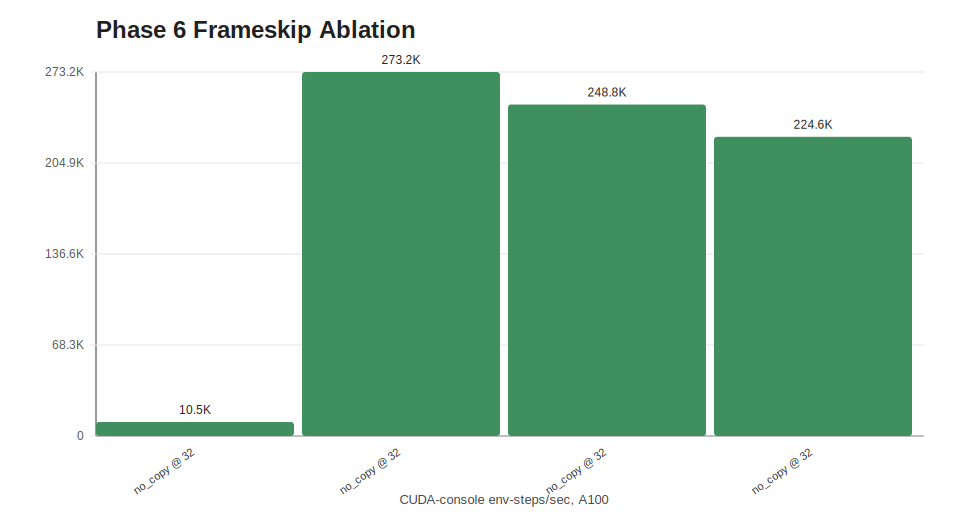

# Phase 6 Research Package

Date: 2026-05-01

## Summary

Phase 6 packages NeSLE as a reproducible research artifact. The repository now
contains:

- a CUDA Dockerfile for NVIDIA builds,
- a one-command Phase 6 reproduction script,
- a CUDA-console ablation benchmark,
- tracked A100 benchmark data,
- generated SVG plots,
- explicit limitations and next optimization targets.

The central result is that the full ROM-backed CUDA CPU/PPU console loop works
through the Python vector API. The performance bottleneck was not getting the
NES loop onto CUDA; it was copying full RGB observations back to host memory on
every step. The project now exposes `observation_mode="ram"`, which keeps the
normal vector `reset()`/`step()` API while returning compact 2 KB CPU RAM
observations instead of 184 KB RGB frames.

## Reproduction

On an NVIDIA CUDA machine:

```sh
python -m pip install -e '.[dev,rl]'
NESLE_CUDA_ARCH=sm_80 PYTHON=python3 sh scripts/build_cuda_extension.sh
NESLE_ROM_PATH="/path/to/Super Mario Bros. (World).nes" sh scripts/reproduce_phase6.sh
```

With Docker:

```sh
docker build -f docker/cuda.Dockerfile -t nesle-cuda .
docker run --gpus all --rm -v "$PWD:/workspace/nesle" -w /workspace/nesle \
  -e NESLE_ROM_PATH="/workspace/nesle/Super Mario Bros. (World).nes" \
  nesle-cuda sh scripts/reproduce_phase6.sh
```

The ROM is not vendored. The benchmark expects a local mapper-0 Super Mario
Bros. iNES file.

## Methodology

The Phase 6 ablation uses `benchmarks/phase6_console_ablation.py`, which
constructs `nesle._cuda_core.CudaBatch(num_envs, frameskip, rom_bytes)` and
steps the real CUDA CPU/PPU console loop. It compares four modes:

- `rgb`: step, render, and copy RGB observations to host.
- `ram_obs`: step the real console loop and copy CPU RAM observations to host.
- `render_only`: step and render on device, but do not copy RGB observations.
- `no_copy`: step the real console loop and copy only rewards/done flags.

All rows below were collected on a Colab A100-SXM4-80GB with CUDA 12.8. The
original comprehensive run is tracked in `docs/data/phase6-a100-summary.json`;
the RAM-observation follow-up is tracked in
`docs/data/phase6-ram-obs-a100.json`.

## Main Result



| Mode | Envs | Env steps/sec | Training frames/sec | Peak GPU util | Peak GPU memory |
| --- | ---: | ---: | ---: | ---: | ---: |
| RGB obs copy | 1 | 136.3 | 545.0 | 74% | 5009 MiB |
| RGB obs copy | 8 | 825.3 | 3,301.3 | 87% | 5009 MiB |
| RGB obs copy | 32 | 1,671.7 | 6,686.7 | 88% | 5015 MiB |
| RGB obs copy | 128 | 3,598.8 | 14,395.0 | 83% | 5033 MiB |
| RAM obs copy | 1 | 7,317.3 | 29,269.1 | 86% | 5009 MiB |
| RAM obs copy | 8 | 54,278.4 | 217,113.6 | 86% | 5009 MiB |
| RAM obs copy | 32 | 196,187.9 | 784,751.5 | 84% | 5015 MiB |
| RAM obs copy | 128 | 560,370.6 | 2,241,482.5 | 75% | 5033 MiB |
| render only | 1 | 137.7 | 550.9 | 88% | 5009 MiB |
| render only | 8 | 865.4 | 3,461.7 | 86% | 5009 MiB |
| render only | 32 | 1,797.7 | 7,190.9 | 86% | 5015 MiB |
| render only | 128 | 4,284.2 | 17,136.6 | 88% | 5033 MiB |
| no obs copy | 1 | 8,278.5 | 33,114.2 | 87% | 5009 MiB |
| no obs copy | 8 | 65,449.4 | 261,797.6 | 87% | 5009 MiB |
| no obs copy | 32 | 248,793.3 | 995,173.2 | 81% | 5015 MiB |
| no obs copy | 128 | 1,008,196.2 | 4,032,784.8 | 96% | 5033 MiB |

At 128 environments and frame-skip 4, RAM observations are about 155x faster
than the RGB-copy path while still returning observations through the normal
step API. A direct public `nesle.make_vec(..., observation_mode="ram")` smoke on
the same A100 measured 428,105.6 env-steps/sec at 128 envs, versus 3,638.8
env-steps/sec for RGB observations.

## Frame-Skip Ablation



| Frame-skip | Envs | Mode | Env steps/sec | Training frames/sec |
| ---: | ---: | --- | ---: | ---: |
| 1 | 128 | no obs copy | 40,788.0 | 40,788.0 |
| 2 | 128 | no obs copy | 1,082,570.7 | 2,165,141.4 |
| 4 | 128 | no obs copy | 1,008,196.2 | 4,032,784.8 |
| 8 | 128 | no obs copy | 863,579.2 | 6,908,633.8 |

Frame-skip 2-8 keeps env-step throughput near the million-step/sec range in
no-copy mode while increasing training-frame throughput. Frame-skip 1 is much
slower because every environment step lands on the expensive startup path more
often in this short benchmark.

## API Surface

`NesleVecEnv.step(...)` now supports both RGB and RAM observations:

```python
env = nesle.make_vec(
    "Super Mario Bros. (World).nes",
    num_envs=128,
    backend="cuda",
    observation_mode="ram",
)
obs = env.reset()  # shape: (128, 2048)
obs, rewards, dones, infos = env.step(actions)
frames = env.render()  # shape: (128, 240, 256, 3)
```

`NesleVecEnv.step_reward(actions)` remains available for custom CUDA-only loops
that need rewards and done flags without any observation copy.

## Limitations

- Mapper support is limited to NROM/Super Mario Bros.
- The PPU is sufficient for current gates, but it is not a full cycle-perfect
  NES renderer.
- RAM observations are not visually equivalent to RGB observations; image-based
  policies still need RGB, frame cadence, feature extraction, or a device-side
  observation path.
- The CUDA-console implementation currently maps one environment to one CUDA
  thread for the serial CPU/PPU loop. This proves the GPU path but leaves
  scheduling and memory-layout optimization on the table.
- The ROM is not redistributed. Reproducers must provide their own legal ROM
  file.
- Colab SSH was used for A100 measurements; the Dockerfile is provided so the
  artifact can move to a cleaner NVIDIA environment.

## Phase 6 Conclusion

Phase 6 is complete as a research package and a usable CUDA training API.
NeSLE now has a reproducible CUDA artifact, public benchmark scripts, tracked
A100 data, generated plots, a documented no-copy reward path, and a normal
`reset()`/`step()` RAM-observation mode that removes the full-frame copy
bottleneck. Future work should add GPU-resident feature tensors for visual
policies and optimize the per-environment serial console loop.
